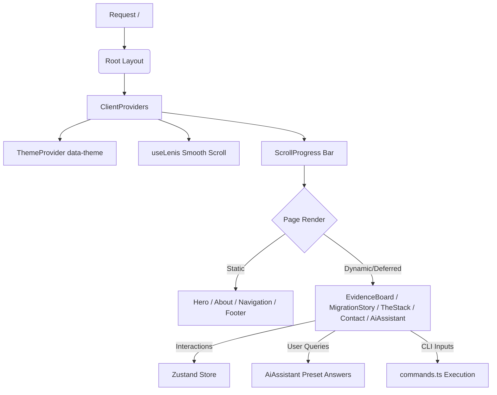

# Architecture

High-level system design and architectural patterns for the Anvith Reddy Rondla portfolio.

## Architectural Overview
The portfolio is designed as a high-performance, single-page web application built with **Next.js 16 (App Router)** and **React 19**, optimized for sub-second page loads and zero infrastructure costs. It separates static layout rendering from client-side interactive elements (the Terminal CLI, AI Assistant chatbot, and smooth scrolling).

> [!NOTE]
> While the portfolio showcases complex production systems (e.g., DPMUMS which uses PostgreSQL, Supabase, Prisma, and NextAuth v5), the portfolio itself runs as a **static-friendly hybrid site** hosted on Vercel's edge network, requiring no databases or authentication APIs.

---

## Patterns & Layers

### 1. Presentation Layer (`src/components/`)
Follows a Component-Based Architecture utilizing functional React components. To ensure optimal performance:
- **Critical Components:** Loaded statically (`Navigation`, `Hero`, `About`, `Footer`) to minimize Initial Server Response time.
- **Interactive / Heavy Components:** Loaded dynamically via `next/dynamic` (`EvidenceBoard`, `MigrationStory`, `GovernmentSection`, `TheStack`, `Contact`, `AiAssistant`) with SSR disabled where appropriate to reduce the initial JavaScript bundle footprint.
- **Interactive Telemetry Panels:** Dynamically adjusts rendering format (chart, map, grid) based on metadata configured in `src/lib/data.ts` using `CaseStudyPreview`.

### 2. State Management Layer (`src/lib/store.ts`)
Global client-side states (e.g., page loading, active sections, sidebar flags) are managed using **Zustand**. 
- **SSR Safety Guard:** The custom `useStore` hook checks if the environment is client-side (`typeof window === 'undefined'`) and supplies static defaults during server rendering to prevent hydration mismatch errors.

### 3. Data & Content Layer (`src/lib/data.ts`)
- Mapped as a unified type-safe TypeScript module exporting `projects`, `techStack`, and `personalInfo`.
- Eliminates runtime file parsing overhead (such as MDX parser utilities) in favor of inline compiler-level static objects, reducing build-time dependencies.

### 4. Routing & Edge Integration (`src/app/`)
- Uses Next.js App Router for sitemaps, robots.txt, and layouts.
- **Edge Runtime Integration:** The dynamic social share card generator (`src/app/og/route.tsx`) runs on the **Vercel Edge Runtime** using `@vercel/og` to dynamically compose PNG images using JSX elements.

### 5. Utility Layer (`src/lib/` & `src/hooks/`)
- Encapsulates domain logic (terminal command registry in `commands.ts`) and global event loops (requestAnimationFrame configurations in hooks).

---

## Data Flow

### 1. Layout Hydration
The server renders the HTML skeleton with inline JSON-LD Schema data for SEO crawlers. On the client, the `ClientProviders` wrapper mounts, activating:
- **`next-themes`**: Restores the user's preferred theme attribute (`data-theme`) to the HTML tag.
- **Lenis (`useLenis`)**: Registers a high-performance requestAnimationFrame loop to override standard browser scrolling.

### 2. Interactive Logic Loops
- **Terminal CLI:** Captures keypresses, queries `src/lib/commands.ts` dynamically, maps aliases, and appends outputs to standard logs.
- **Preset Chatbot:** Intercepts user prompts, streams responses character-by-character, and blocks spam inputs after a 10-message limit is hit.
- **Confetti Engine:** When the scroll-to-top button is triggered, the engine spawns absolute DOM divs and translates them using classical physics/gravity calculations under requestAnimationFrame, bypassing the need for heavy canvas dependencies.

---

## Key Abstractions

- **`Command` System:** A structured type interface representing terminal actions with execution callbacks, categories, and alias support.
- **`Project` Model:** A unified interface defining key project details, metrics, timeline decision nodes, and the type of preview telemetry panel to draw.
- **`useLenis` Hook:** An asynchronous imports wrapper that loads the Lenis smooth-scrolling library only in the browser, preventing Node.js SSR runtime crashes.
- **`useCountUp` Hook:** An IntersectionObserver-driven animation hook that counts numeric values up smoothly only when they enter the viewport.
